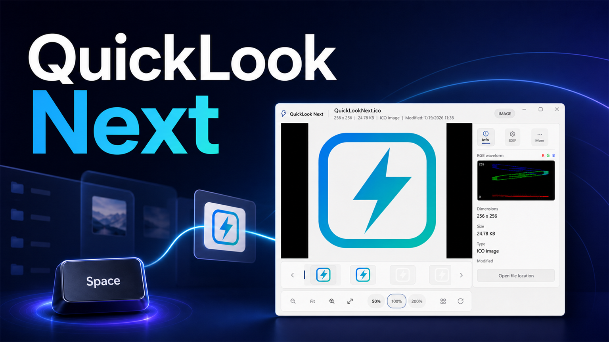

# QuickLook Next

[项目网站](https://sherlockchiang.github.io/QuickLook.Next/) · [English](README.md)

**在 Windows 文件资源管理器中选中文件，按一下空格键，立即预览。**

[](https://github.com/SherlockChiang/QuickLook.Next/releases/latest)




QuickLook Next 是快速、原生的 Windows 文件预览工具。WinUI 3 界面、Rust 解析、GPU 合成图片表面和隔离辅助进程共同保障预览流畅性与安全性。

[访问沉浸式项目网站 →](https://sherlockchiang.github.io/QuickLook.Next/)

## 快速开始

1. 从[最新版本](https://github.com/SherlockChiang/QuickLook.Next/releases/latest)下载 `QuickLook.Next-Installer-*-win-x64.zip`。
2. 解压 ZIP，运行 `Install-ZH-CN.cmd`。
3. 同意管理员提示，完成安装，然后从开始菜单启动 **QuickLook Next**。
4. 在文件资源管理器中选中文件，按 **空格键**。

安装程序包含已签名的 MSIX 和对应的项目开发证书。Windows 需要管理员确认，才能信任用于侧载的证书。该签名属于开发签名，不是商业 Authenticode 信任，因此 Windows 仍可能对安装脚本显示安全提示。

## 为什么选择 QuickLook Next？

- **一键预览：** 按 `空格键` 打开或关闭预览，通过方向键跟随资源管理器选中项。
- **完整图片体验：** 缩放和平移图片，查看 EXIF、色彩信息和波形，并通过底部胶片栏浏览相邻图片。
- **实用文档视图：** 阅读 PDF、Markdown、源代码、虚拟化 CSV 表格和近似 Office 版式。
- **结构化数据：** 以可切换工作表预览有明确边界的 SQLite 表数据，并提供浮动表头和真实的部分数据提示。
- **广泛格式支持：** 支持压缩包、音视频、字体、证书、可执行文件、电子书、邮件、文件夹等内容。
- **隔离解析：** 复杂解析器和光栅解码器运行在受限制、可取消的辅助进程中。
- **透明云端行为：** 仅在线文件会先显示下载状态；不支持的内容不会伪装成巨大的文件图标。
- **遵循 Windows 体验：** 支持高对比度、减少动态效果、键盘导航和多显示器 DPI。

## 快捷键

| 操作 | 快捷键 |
| --- | --- |
| 打开或关闭预览 | `空格键` |
| 关闭预览 | `Esc` |
| 跟随资源管理器中的上一个或下一个项目 | 方向键 |
| 缩放图片 | 鼠标滚轮或 `+` / `-` |
| 重置图片视图 | `Home` 或 `Ctrl+0` |
| 浏览相邻图片 | 图片预览获得焦点时按 `Left` / `Right` |

焦点位于文本框、按钮、列表项、开关或滑块时，空格键会保留 Windows 控件的标准行为。关闭预览只会隐藏窗口，QuickLook Next 仍在系统托盘中等待使用。

## 支持的内容

| 类别 | 预览体验 |
| --- | --- |
| 图片 | JPEG、PNG、APNG、GIF、WebP、BMP、TIFF；HEIC、AVIF 等格式可使用系统解码器 |
| PDF 和 Office | 虚拟化 PDF 页面，以及 DOCX、XLSX、PPTX 的近似预览 |
| 文本和数据 | 纯文本、源代码、配置文件、Markdown、CSV、TSV 和 SQLite 表格工作表 |
| 压缩包和软件包 | 有安全边界的文件列表、元数据摘要、软件包图标和受支持容器的内部文件预览 |
| 音视频 | Windows Media Foundation 支持的格式，以及轻量容器和编码信息 |
| 专业格式 | 字体、证书、PE/EXE/DLL、ELF、Minidump、Torrent、邮件、电子书、CHM 和磁盘映像元数据 |
| 文件夹 | 有安全数量限制的目录列表和按优先级加载的缩略图 |

部分格式依赖 Windows 可选解码器。Office 预览不会运行 Microsoft Office、宏、公式重算、嵌入脚本或浏览器引擎，因此复杂文档的版式可能与 Office 本身不同。

## 云端文件

QuickLook Next 会区分已下载的云端文件和仅在线占位文件：

- 已下载的 OneDrive 等云端文件与本地文件使用相同的完整预览路径。
- 仅在线文件会先显示明确的下载状态。
- 下载完成后，QuickLook Next 会重新探测真实内容并打开正确的预览。
- 下载可以取消并有超时限制，不会留下隐藏的后台读取。
- 无法安全确认可用性时，非图片格式会保留元数据视图，而不是回退成 Shell 文件图标。

## 校验下载

每个版本都在 Installer ZIP 旁提供 SHA-256 文件：

```powershell
$zip = Get-Item .\QuickLook.Next-Installer-*-win-x64.zip
Get-FileHash $zip.FullName -Algorithm SHA256
Get-Content "$($zip.FullName).sha256"
```

只有哈希一致，并且两个文件都来自本仓库 Releases 页面时才应继续安装。

## 系统要求

- Windows 10 1809 或更高版本，或 Windows 11。
- x64 处理器。
- 使用 Windows 文件资源管理器进行全局空格键集成。
- Windows 合成系统支持的显卡和驱动。

发布包已包含应用所需的 Windows App SDK 运行组件。部分图片和音视频格式仍可能需要 Windows 或 Microsoft Store 提供的可选解码器。

## 常见问题

### 按空格键没有反应

- 确认 QuickLook Next 正在运行且系统托盘图标存在。
- 将 Windows 文件资源管理器切换到前台并选中文件。
- 结束文件重命名或资源管理器文本框输入；程序会有意在这些场景保留空格键。
- 退出可能也在监听空格键的旧版 QuickLook 或 QuickLook Next。

### 预览只显示元数据或部分结果

- 文件可能仍在从云端存储下载。
- Windows 可能没有该格式所需的可选解码器。
- 解析器可能达到了明确的大小、行数、页数或时间限制。
- SQLite 只采样有安全边界的行，并将不完整的工作表标记为“部分数据”。

### 反馈问题

请[创建 Issue](https://github.com/SherlockChiang/QuickLook.Next/issues)，说明 Windows 和 QuickLook Next 版本、文件类型和大致大小、预期与实际结果、复现步骤及相关日志。请勿上传隐私文件。当前贡献状态和维护者工程流程参见 [`CONTRIBUTING.md`](CONTRIBUTING.md)。

<details>
<summary><strong>从源码构建</strong></summary>

需要 Windows x64 和 Desktop C++/MSVC 工具链、[`global.json`](global.json) 指定的 .NET SDK，以及 [`rust-toolchain.toml`](native/quicklook_next_native/rust-toolchain.toml) 指定的 Rust MSVC 工具链。

```powershell
dotnet restore QuickLook.Next.slnx --locked-mode
cargo test --locked --manifest-path native/quicklook_next_native/Cargo.toml
cargo build --release --locked --manifest-path native/quicklook_next_native/Cargo.toml
dotnet build QuickLook.Next.slnx -c Release --no-restore
dotnet test QuickLook.Next.slnx -c Release --no-build --no-restore
```

`tools/release.ps1` 是本地 restore、test、build、签名和打包的唯一权威入口。发布产物生成到 `artifacts/`。

</details>

<details>
<summary><strong>架构与发布</strong></summary>

- `QuickLook.Next.App`：WinUI 3 外壳、预览 Presenter、输入处理和进程监管。
- `quicklook_next_native`：Rust 文件探测、资源管理器集成、解析器、缩略图和图片解码。
- `QuickLook.Next.ParserHost`：隔离处理压缩包、Office、电子书、可执行文件等结构化解析。
- `QuickLook.Next.RasterHost`：通过共享 GPU 表面隔离处理图片、PDF 和系统解码器渲染。
- App 与 Host 使用仅限当前用户、经过认证的命名管道，并通过取消和过期结果守卫确保请求隔离。

Pull Request 会运行 CI；贡献和验证要求参见 [`CONTRIBUTING.md`](CONTRIBUTING.md)。经过本地完整验证、标题以 `release:` 开头的提交会运行稳定版打包工作流。发布资产包含签名安装包、校验值、Release 元数据、更新元数据、构建清单和 SBOM。

工程边界和验证详情参见 [`docs/review-readiness.md`](docs/review-readiness.md)。

</details>

## 安全问题

请勿通过公开 Issue 披露尚未修复的安全漏洞。私密报告流程和敏感样本处理要求参见 [`SECURITY.md`](SECURITY.md)。

## 许可证

QuickLook Next 的原创源代码和资产采用 [MIT License](LICENSE)。随附的第三方组件仍适用其各自的许可证和声明。
